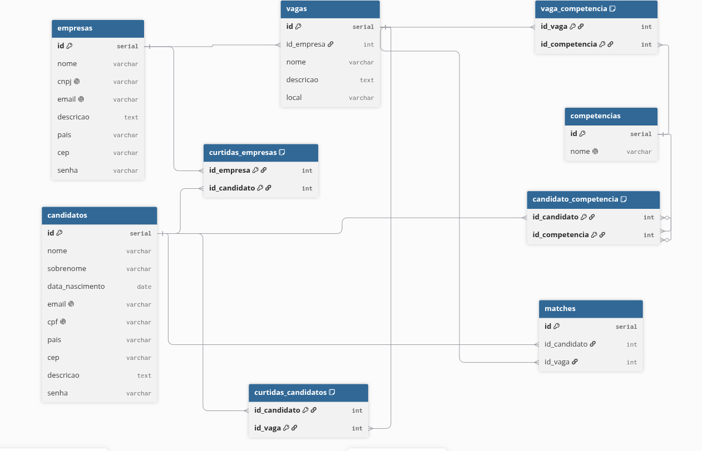

<div align="center">
  
</div>

# Linketinder - Arquitetura Limpa & Integração JDBC

Projeto Full-Stack desenvolvido para o desafio ZG-HERO.
Um sistema inovador de recrutamento que une o modelo de networking do LinkedIn com a dinâmica ágil de "Match" do Tinder, aplicando o conceito de recrutamento às cegas para focar em competências.

**Desenvolvedor:** Michel Lavanere Sampaio

---

## Refatoração SOLID e Clean Architecture (Release v1.8.0)
Nesta versão, a aplicação (tanto Backend quanto Frontend) passou por uma refatoração arquitetural profunda baseada nos 5 princípios **SOLID** e nas boas práticas de **Clean Code** de Robert C. Martin:

1. **(S) Responsabilidade Única (SRP):**
   - *Backend:* Separação estrita entre `Models` (estado), `Services` (regras de negócio) e `DAOs` (persistência). A classe `GerenciadorDePerfis` atua como padrão *Facade*.
   - *Frontend:* A lógica das páginas foi dividida no padrão MVC, isolando validações nativas em classes especialistas (`RegexValidator` e `DocumentValidator`).
2. **(O) Aberto/Fechado (OCP):**
   - Criação de contratos que permitem a expansão do sistema (ex: plugar um novo banco de dados) sem modificar as regras de negócio existentes.
3. **(L) Substituição de Liskov (LSP):**
   - Utilização correta de herança clássica nos domínios (ex: `Candidato extends Pessoa`), garantindo que subclasses substituam as classes pai sem quebrar a integridade estrutural.
4. **(I) Segregação de Interface (ISP):**
   - Substituição de interfaces infladas por interfaces coesas. Foram criados os contratos `ICrudDAO` e `IMatchDAO` no Backend, e `ICrudService` e `IAuthService` no Frontend.
5. **(D) Inversão de Dependência (DIP):**
   - *Core da Refatoração:* Classes de alto nível (`Services` no Groovy e `Controllers` no TypeScript) deixaram de instanciar integrações concretas. Agora, elas dependem exclusivamente de **Interfaces injetadas via Construtor**.
   - *Impacto nos Testes:* Graças ao DIP, a suíte de testes com **Spock Framework** agora mocka interfaces nativamente, tornando os testes de unidade puramente independentes da infraestrutura.

---

## Funcionalidades e Arquitetura

O sistema utiliza uma arquitetura em camadas conectada a um banco de dados relacional.

### 1. Backend (Groovy + JDBC)
- **Camada de Visão (View):** Menus interativos modularizados por entidade (`CandidatoView`, `EmpresaView`, `VagaView`).
- **Camada de Serviço (Service):** Detentora do coração do sistema, validando fluxos de negócio com *Fail-Fast* (capturando `SQLException` e lançando `RuntimeException` tratadas).
- **Design Pattern DAO:** Persistência via JDBC puro no PostgreSQL. Utiliza `Statement.RETURN_GENERATED_KEYS` para salvar relações N:N automatizadas.

### 2. Arquitetura de Dados (PostgreSQL)
A modelagem seguiu as regras de normalização (1FN até 3FN). O detalhamento e scripts DDL/DML encontram-se na [Pasta Database](./database).

<div align="center">
  <a href="./database">
    
  </a>
  <p><i>Acesse a pasta /database para ver a Lógica de Match detalhada.</i></p>
</div>

### 3. Frontend (Web Vanilla TS)
O MVP visual é composto por telas independentes com garantia de anonimato até o "match":
- **Dashboard Corporativo:** Lista candidatos anonimamente e exibe gráfico dinâmico (Chart.js) de competências.
- **Mural de Vagas:** Visão do candidato ocultando o nome do empregador até a demonstração mútua de interesse.
- *Nota Arquitetural:* Através do DIP, o Frontend em MVC está completamente preparado para plugar consumo de APIs (Fetch/Axios) trocando apenas a injeção na raiz da aplicação.

---

## Tecnologias Utilizadas

**Backend & Dados:**
- Groovy (4.0.22) & Java JDK 8 (Zulu)
- PostgreSQL & JDBC Driver
- Spock Framework (2.3) - *Para testes de unidade guiados a comportamento (BDD)*
- Gradle

**Frontend:**
- TypeScript
- Vite
- Chart.js
- HTML5 & CSS3 (Sem frameworks)

---

## Como Executar a Aplicação

O projeto requer que o banco de dados seja inicializado antes do backend.

### Passo 1: Inicializando o Banco de Dados
1. No seu client do PostgreSQL, crie um banco vazio: `CREATE DATABASE linketinder;`
2. Execute o arquivo `database/linketinder_init.sql` para gerar a estrutura e os mocks básicos.
3. Execute o arquivo `database/linketinder_match.sql` para gerar a lógica de cruzamento de perfis.

### Passo 2: Rodando o Backend (Console)
Acesse a pasta do backend, configure suas credenciais JDBC, e execute via Gradle:
```bash
./gradlew run