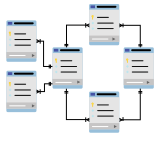
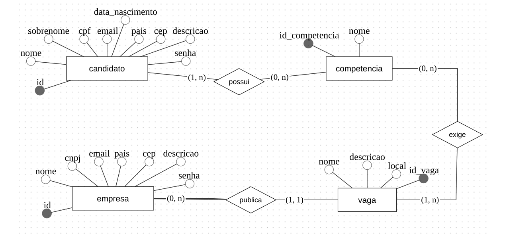
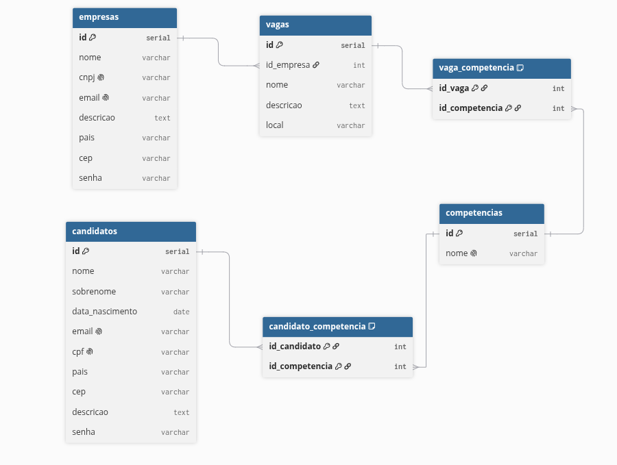

<div align="center">
  
</div>

# Linketinder - Banco de Dados

Este diretório contém toda a documentação estrutural e os scripts de inicialização do banco de dados relacional (PostgreSQL) do projeto Linketinder.

**Desenvolvedor:** Michel Lavanere Sampaio

## Estrutura do Diretório

*   **`linketinder_init.sql`**: Script SQL completo contendo a DDL (criação das tabelas e restrições) e a DML (inserção de dados mockados para testes).
*   **`assets/`**: Diretório contendo as imagens dos diagramas de modelagem (MER/DER).

## Modelagem e Normalização

O banco de dados foi projetado focando na integridade dos dados e na eliminação de redundâncias, passando pelas três primeiras Formas Normais (1FN, 2FN e 3FN):

1.  **Modelo Conceitual (brModelo):** Focado nas regras de negócio. Atributos compostos e multivalorados foram atomizados. A entidade `Competencias` foi isolada para permitir que candidatos e vagas se relacionem com ela sem duplicar informações.

<div align="center">
    
</div>

2.  **Modelo Lógico/Físico (dbdiagram.io):** Tradução para o modelo relacional, onde as relações **N:N** (Candidato ↔ Competência e Vaga ↔ Competência) foram resolvidas com tabelas associativas, e a relação **1:N** (Empresa ↔ Vaga) foi amarrada via Chave Estrangeira (`id_empresa`).

<div align="center">
  
</div>

## Como Inicializar o Banco

1.  Certifique-se de ter o **PostgreSQL** instalado e o serviço em execução.
2.  Abra o seu client favorito (pgAdmin, DBeaver, IntelliJ Database Tool ou terminal `psql`).
3.  Crie um novo banco de dados vazio:
    ```sql
    CREATE DATABASE linketinder;
    ```
4.  Conecte-se ao banco `linketinder`.
5.  Execute o conteúdo do arquivo `linketinder_init.sql`.

O script irá criar **6 tabelas** (candidatos, empresas, vagas, competencias, candidato_competencia e vaga_competencia) e popular o banco com **5 perfis de cada entidade** para que você possa realizar as consultas que quiser.