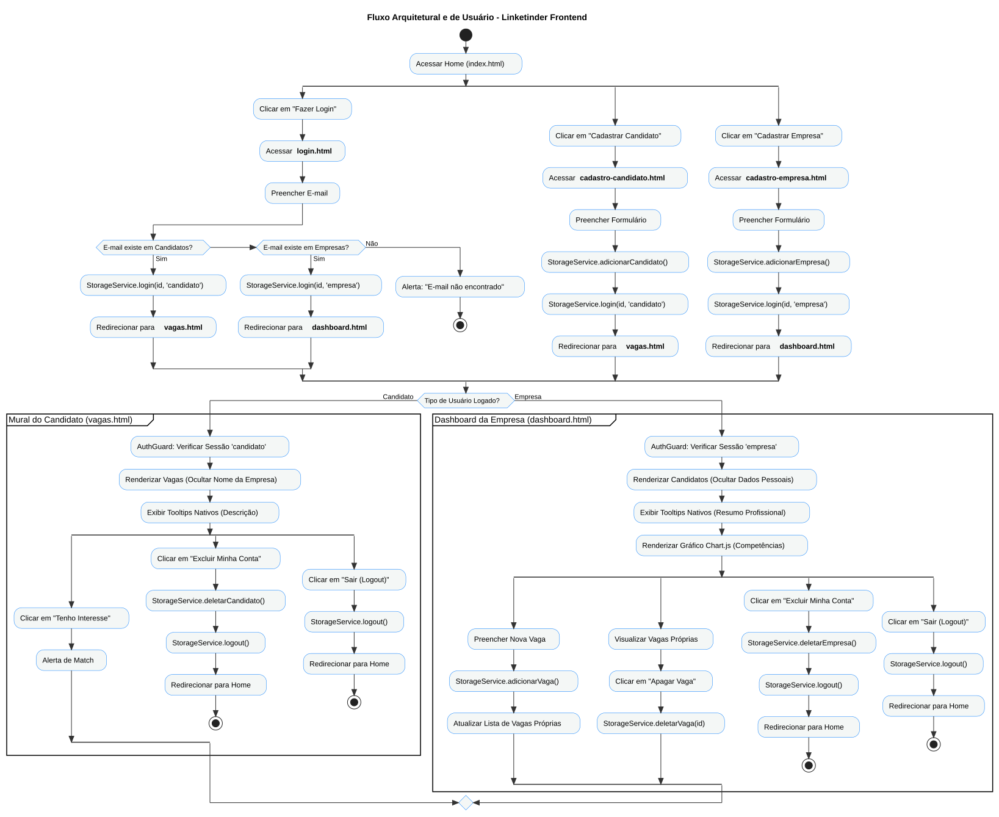

# Linketinder - Frontend MVP

Interface web construída para o projeto Linketinder, aplicando conceitos de Single Page Application (SPA), componentização e regras de negócio de anonimato e matching.

### Autor: **Michel Lavanere Sampaio**

## Fluxo de Interação do Usuário

Abaixo está o diagrama que ilustra o ciclo de vida do usuário na aplicação, mapeando as rotas de entrada, lógicas de controle de sessão e restrições de deleção baseadas no tipo de perfil (Candidato vs Empresa).



## Tecnologias Utilizadas
* **TypeScript:** Tipagem estática e interfaces rigorosas (`models`).
* **Vite:** Bundler de alta performance.
* **Chart.js:** Visualização de dados (Gráficos de competências).
* **HTML5/CSS3:** Sem frameworks de estilo, utilizando CSS modular.
* **LocalStorage:** Persistência de dados e simulação de controle de sessão (`StorageService`).

## Arquitetura do Projeto
O projeto foi estruturado seguindo o padrão de Componentes (similar ao Angular), garantindo alta coesão e baixo acoplamento:

```
frontend/
├── index.html                 # Ponto de entrada / Home
├── login.html                 # Rota simulada
├── [outros .html]             # Templates limpos
└── src/
    ├── style.css              # CSS Global (Reset e utilitários)
    ├── models/                # Interfaces TypeScript (IPessoa, ICandidato, IVaga)
    ├── services/              # Lógica de persistência e Sessão (StorageService)
    └── pages/                 # Componentes Modulares
        ├── dashboard/
        │   ├── dashboard.ts   # Lógica e manipulação do DOM
        │   └── dashboard.css  # Estilo isolado do componente
        └── [outros componentes]
```

## Funcionalidades
* **Autenticação Simulada:** Proteção de rotas baseada no tipo de usuário logado.
* **CRUD com Restrições:** Empresas apagam apenas suas vagas/contas; Candidatos apagam apenas seus perfis.
* **Anonimato e Tooltips:** Dados sensíveis ocultos nas listagens, com tooltips nativos (`title`) para resumos e detalhes.
* **Data Visualization:** Gráfico em tempo real demonstrando as competências mais procuradas.

## Como Executar
1. Certifique-se de ter o [Node.js](https://nodejs.org/) instalado.
2. Na raiz da pasta `frontend`, instale as dependências:
   \`npm install\`
3. Inicie o servidor de desenvolvimento:
   \`npm run dev\`